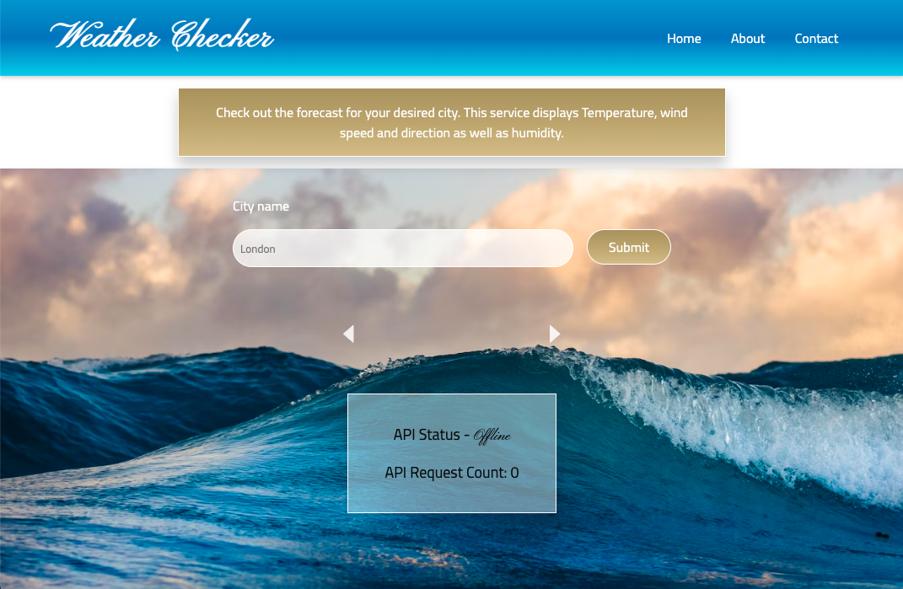

# Weather Checker

---

## Description

This is a responsive weather application built with ASP.NET Core and React. It allows users to enter a desired city and view weather data, including temperature, wind speed, direction, and humidity. Users can also recall a favorite city during the app's operational session. For system owners, the infrastructure offers continuous monitoring of the API's health status. It also provides analytical data, specifically tracking the count of API calls made since the platform's launch. 

This project utilized an agile work methodology, Test-Driven Development (TDD), and integrated CI/CD with Azure.

---

## Technologies and methodology

- ASP.NET Core
- C#
- React
- CI/CD
- XUnit
- TDD
- Azure
- Responsivity

---

## Documentation

During the construction of this application, I followed these steps:

### Workflow for backend and testing

- I began by adding a test to ensure the API call functionality was working correctly.
- Next, I initialized the /weather endpoint. When accessed via a GET request, this endpoint creates a new HttpClient instance but initially neither processed nor returned any response.
- I added a failing test aimed at fetching the weather data for Stockholm.
- I subsequently defined the /weather route to retrieve Stockholm's current weather using the Weather API. This route either utilizes a given API key or defaults to a preset one. After implementation, the weather data is returned as a JSON response, leading the previously failing test to succeed.
- I added another failing test to ensure the /healthcheck endpoint returned an "OK" status code. At this stage, the /healthcheck GET request was established but provided an empty response.
- I then modified the /healthcheck endpoint to consistently return “OK”, which caused the aforementioned test to pass.
- To enhance the application's robustness, I incorporated a test to guarantee the /healthcheck endpoint returns an HTTP status code of 200 (OK) when accessed.
- I then added a failing test that, in an asynchronous manner, retrieves the counter's value from the designated URL and expects it as a JSON object. Concurrently, I drafted an unimplemented /counter endpoint.
- Finally, I implemented the counter endpoint and its associated functionalities, resulting in the preceding test's success.

This organized approach, utilizing priorities and a Test-Driven Development methodology, ensured each component was rigorously checked before its respective implementation.

### Workflow for frontend

- Started by implementing a responsive navigation section tailored for mobile devices, complemented with appropriate styling.
- Introduced an intro section, styled and designed to enlighten users about the app's functionality.
- Integrated a carousel component to enhance user interactivity.
- Incorporated arrow buttons to facilitate navigation within the carousel.
- Developed a dedicated component to accurately display weather details.
- Implemented a component allowing users to add their desired cities.
- Enhanced the system with functionality to monitor API health and status.

---

Left

Code:

- Sätta upp och använda en enklare CI/CD-pipeline med Azure
- För att sätta upp en pipeline för att deploya API:et så måste React-klienten gå att peka både mot den deployade versionen av API:et och lokal version om man önskar (för utveckling)

Readme:

- En beskrivning av er pipeline
- Inspelad presentation/demo, cirka 5-10 minuter

